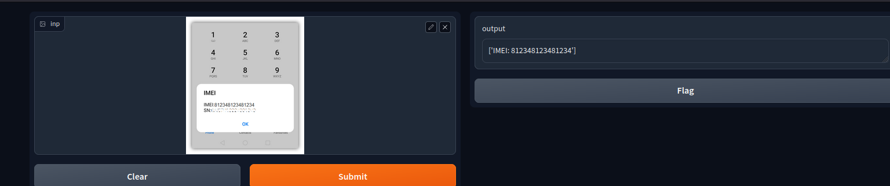

# Docker Image
## Pull Docker Image
```bash
docker pull gutfangam/imei_detector:gradio 
``` 

## Run Image
```bash
docker run -it -p 7860:7860 gutfangam/imei_detector:gradio
```

# Create Environment

### Run Following command

Conda :                
```bash
conda create -n <virtual-environment-name> python==3.10.12
```


Virtual Environment :  
```bash
python 3.10.12 -m venv <virtual-environment-name>
```
# Clone repository
```bash
git clone https://github.com/Drwaish/cv_18_aug.git
cd cv_18_aug
``` 

# Install Requirements
After clonning repo, execute following command
```bash
pip install -r requirements.txt
```
If you face any error click <a href ="https://stackoverflow.com/questions/50896528/error-while-installing-tesseract-ocr"> here </a>


# Folder Structure
```
    cv_aug_18
    |
    |
    |------images
    |         |----image 1
    |         |
    |         |----image 2
    |         |
    |         |----image 3
    |         |------.
    |         |      .
    |-------modules
    |          |----detection.py
    |          |----preprocess.py
    |-------main.py
    |-------gradio_interface.py
```
# Run Versions 
## Gradio App
```bash
python3 gradio_interface.py
```

## Console base
```bash
python3 main.py
```
# Gradio Demo


# Command Line Execution
```
Enter path of image : images/image-4.jpeg
Result ['IMEI: 012938002938000']
                         Want to use again Press 'y'. 
                         Otherwise press 'n'. n

            Good Bye have a nice day!
            See you soon
```
After pressing n or N, execution will be stop with good bye message.


